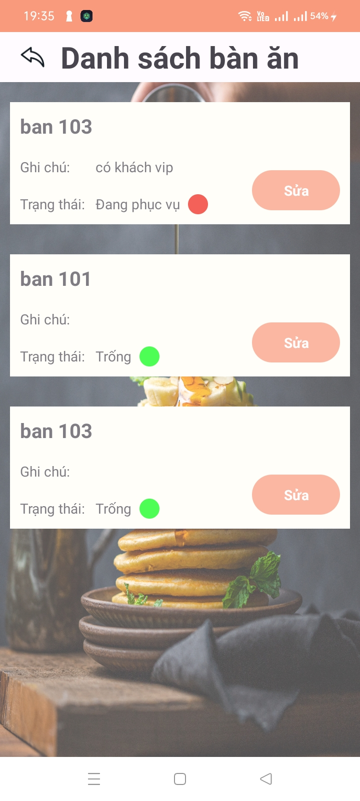

# 1. Mục tiêu
  Cung cấp ứng dụng quản lý quán ăn, giúp quản lý quán ăn dễ dàng hơn, giảm thiểu thời gian và công sức của người quản lý.

# 2. Các chức năng chính
    - Quản lý thông tin món ăn
    - Quản lý thông tin và trạng thái bàn ăn
    - Quản lý danh sách món ăn
    - Thống kê doanh thu
  
# 3. Công nghệ sử dụng
    - Frontend: Android (Java)
    - Backend: NodeJS
    - Database: MongoDB

# 4. Một số hình ảnh minh họa

| Màn hình đăng nhập| Màn hình chính dành cho tài khoản quản lý | Màn hình chính dành cho tài khoản nhân viên |
| --- | --- | --- |
|  |  |  |

 | Màn hình quản lý món ăn | Màn hình quản lý bàn ăn dành cho quản lý | Màn hình thống kê doanh thu | Màn hình quản lý bàn ăn
| --- | --- | --- | --- |
|  |  |  |  |

